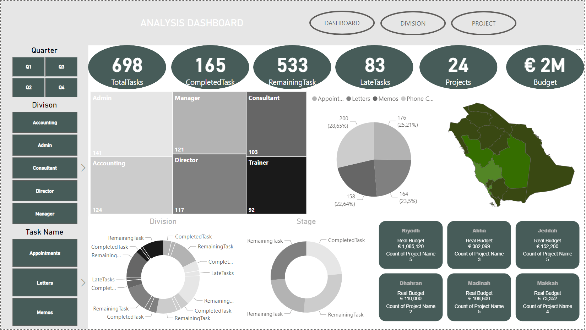
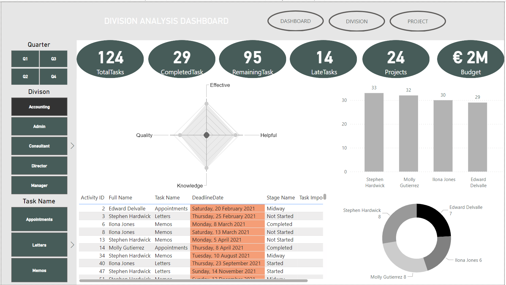

# Company Analytics Dashboard

This repository contains detailed dashboards designed to analyze employee contributions, project performance, and other key metrics related to work distribution and project execution within the company.

## Overview

The dashboards offer insights into various aspects of the company's operations, including:

- **Employee Contribution**: Tracks tasks completed by employees, their performance on projects, and the stages of task completion.
  
- **Project Metrics**: Provides an overview of active projects, the tasks remaining, late tasks, and the percentage of completion.
  
- **Location and Budget**: Analyzes project distribution across different geographical regions, detailing real budgets and project counts per region.

- **Task and Division Analysis**: Allows filtering by division and task type to provide a granular view of the workload distribution among teams and employees.

## Dashboards

### 1. Analysis Dashboard

This dashboard shows overall task distribution, completed and remaining tasks, late tasks, and budget allocation across projects. It also provides a geographical view of project locations and division-based task breakdown.

### 2. Employee Activity Dashboard

This dashboard focuses on employee activity, highlighting the number of tasks each employee is responsible for, their deadlines, and the stage of task completion. It also displays a radar chart analyzing employees based on various performance indicators like quality, knowledge, and helpfulness.

### 3. Project Analysis Dashboard

This dashboard provides a deeper dive into the projects' specifics, displaying task counts per project, the budget involved, and each project's progress. It includes details about task importance and the status of each task.

---

